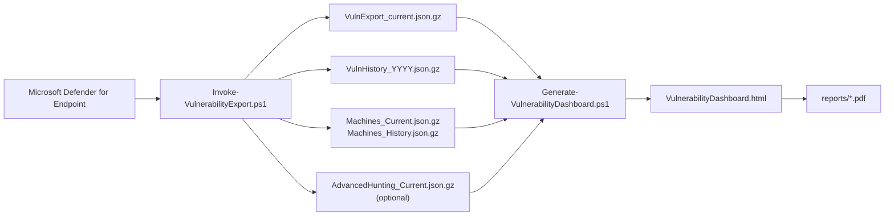
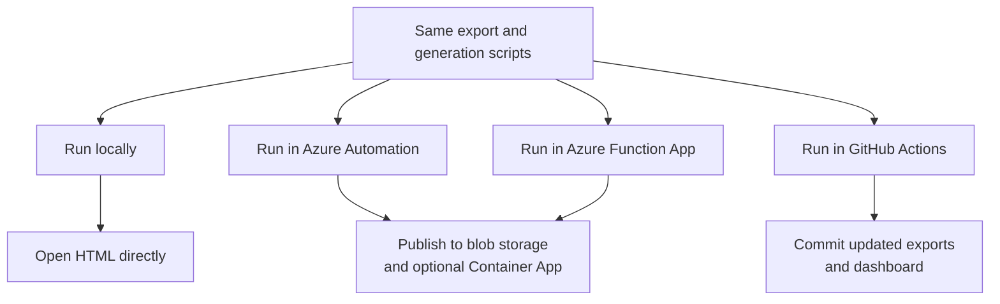

# Defender Vulnerability Reporting Dashboard


Defender for Endpoint vulnerability reporting has always been a pain point, and this felt like a great opportunity to use AI-assisted coding to build a dashboard without a dependency on Power BI or other expensive tools. The result is a PowerShell-built dashboard that defaults to a self-contained HTML artifact for direct-open use, with an opt-in split-assets mode for hosted deployments, along with validation tooling, Azure automation assets, GitHub Actions workflows, and sample PDF report outputs.

I have provided the starting prompt and much of the creation history for anyone interested in how it came together here: [`copilot_all_prompts_2025-12-30T05-04-10.chatreplay.json`](copilot_all_prompts_2025-12-30T05-04-10.chatreplay.json)

## How it works



## Quick start

1. Export data from Defender for Endpoint.

```powershell
$secret = Read-Host -AsSecureString -Prompt 'Enter client secret'
.\Invoke-VulnerabilityExport.ps1 `
    -TenantId 'your-tenant-id' `
    -AppId 'your-app-id' `
    -AppSecret $secret `
    -OutputPath .\exports `
    -IncludeAdvancedHunting
```

2. Generate and validate the default self-contained dashboard.

```powershell
.\Generate-VulnerabilityDashboard.ps1 `
    -DirectoryPath .\exports `
    -OutputPath .\VulnerabilityDashboard.html `
    -ExportMachineData $false `
    -Validate
```

3. Generate the hosted split-assets variant when you want browser caching and smaller HTML.

```powershell
.\Generate-VulnerabilityDashboard.ps1 `
    -DirectoryPath .\exports `
    -OutputPath .\VulnerabilityDashboard.Hosted.html `
    -ExportMachineData $false `
    -SplitAssets `
    -Validate
```

Recommended convention: keep `VulnerabilityDashboard.html` as the direct-open artifact, and use `VulnerabilityDashboard.Hosted.html` for the hosted build. The hosted build writes a sibling `VulnerabilityDashboard.Hosted.assets\` directory containing the dashboard CSS, JavaScript, libraries, and compressed payload.

4. Re-run validation later without regenerating the HTML.

```powershell
.\Generate-VulnerabilityDashboard.ps1 `
    -DirectoryPath .\exports `
    -OutputPath .\VulnerabilityDashboard.html `
    -ValidateOnly
```

For managed identity auth, Azure provisioning, and GitHub workflow setup, use the linked docs below.

## Dashboard packaging modes

`Generate-VulnerabilityDashboard.ps1` supports two delivery modes:

- Default: a self-contained HTML dashboard that can be opened directly from disk and works well for offline or file-share workflows.
- `-SplitAssets`: a hosted variant that writes relative asset files beside the HTML so browsers can cache the CSS, JavaScript, libraries, and compressed payload independently.

Recommended project convention:

- Commit `VulnerabilityDashboard.html` as the canonical repo artifact.
- Generate `VulnerabilityDashboard.Hosted.html` only for hosted publishing, release artifacts, or deployment packaging.

Azure note: `Setup-AzureResources.ps1` resolves this automatically. With `-IncludeContainerApp`, Azure defaults to the hosted split-assets mode. Without a Container App, Azure defaults to the self-contained mode unless you override it.

Use the split-assets mode when you plan to serve the dashboard over HTTP or HTTPS. Browsers commonly restrict `fetch` from `file://` URLs, so the split-assets variant is not intended to replace the direct-open self-contained output.

For local testing of the split-assets build, use a local HTTP server instead of opening the HTML file directly from disk.

## Documentation

| Topic | What it covers |
|---|---|
| [Azure setup](docs/azure-setup.md) | API permissions, authentication options, Azure Automation provisioning, and Container App publishing |
| [GitHub Actions setup](docs/github-actions-setup.md) | OIDC service principal setup, required repository secrets, and branch protection guidance |
| [Workflow notes](docs/workflows.md) | What each workflow does and when to use it |
| [Changelog](CHANGELOG.md) | Release-style summary of notable changes |

## Core scripts

| Script | Purpose |
|---|---|
| `Invoke-VulnerabilityExport.ps1` | Downloads Defender exports and writes the canonical gzip data store |
| `Generate-VulnerabilityDashboard.ps1` | Builds the dashboard in self-contained or split-assets form and can validate the result |
| `Validate-DashboardReports.ps1` | Validates an existing dashboard HTML against committed exports |
| `Setup-AzureResources.ps1` | Provisions Azure compute (Automation Account or Function App), storage, scheduling, and optional Container App hosting |
| `Setup-GitHubActionServicePrincipal.ps1` | Creates the Entra app and federated credential for GitHub Actions OIDC |

## Canonical data files

| File | Purpose |
|---|---|
| `exports/VulnExport_current.json.gz` | Current open vulnerability row versions |
| `exports/VulnHistory_YYYYQn.json.gz` | Historical row versions closed during each quarter |
| `exports/VulnHistoryRows_YYYYQn.json.gz` | Historical row observation detail used for window normalization |
| `exports/VulnContentDictionary.json.gz` | Shared vulnerability content dictionary for content-store mode |
| `exports/VulnCurrentRefs.json.gz` | Current vulnerability references into the content dictionary |
| `exports/VulnHistoryRefs_YYYYQn.json.gz` | Historical vulnerability references into the content dictionary |
| `exports/Machines_Current.json.gz` | Latest known state per device |
| `exports/Machines_History_YYYYQn.json.gz` | Machine state changes by quarter |
| `exports/AdvancedHunting_Current.json.gz` | Latest known CVE enrichment from Advanced Hunting |

## Delivery paths



## Notes

- `shared-helpers.ps1`, `validation-helpers.ps1`, `azure/Invoke-DashboardPipeline.ps1`, and `azure/function-app/ExportAndGenerate/run.ps1` are generated on demand and ignored by git.
- Edit `shared/source/*.ps1`, `validation/source/*.ps1`, and `azure/runbook-source.ps1`; rebuild generated deployment artifacts with `./azure/Build-Runbook.ps1`, `./azure/Build-FunctionApp.ps1`, `./Build-SharedHelpers.ps1`, or `./Build-ValidationHelpers.ps1` only when you need the materialized outputs.
- Run `./Invoke-RegressionValidation.ps1` for the deterministic local and PR-aligned preflight path.
- Run `./Invoke-LiveDashboardDryRun.ps1 -UseExistingAzContext` when you want the local command that mirrors the live GitHub Actions export and dashboard generation path.
- Legacy `VulnExport_<group>_<date>.json(.gz)` compatibility remains temporary through `2026-07-01`.
- Sample PDF outputs are committed under `reports/`.
- `.dashboard-cache/` directories are derived local caches and are intentionally ignored by git.
- Manual troubleshooting harnesses live under `tests/manual/` and default to ignored local output paths.
- Recorded benchmark baselines are summarized in `docs/performance-baselines.md`; raw benchmark JSON stays local-only.
