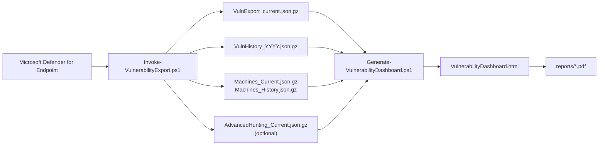
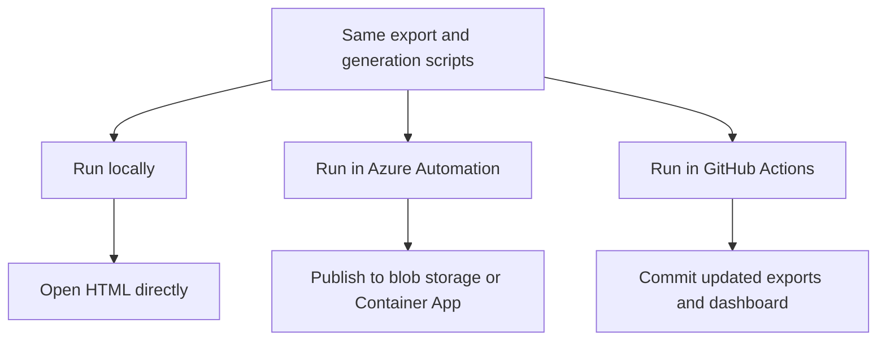

# Defender Vulnerability Reporting Dashboard


Defender for Endpoint vulnerability reporting has always been a pain point, and this felt like a great opportunity to use AI-assisted coding to build a dashboard without a dependency on Power BI or other expensive tools. The result is a self-contained HTML dashboard built with PowerShell, along with local scripts, validation tooling, Azure automation assets, GitHub Actions workflows, and sample PDF report outputs.

I have provided the starting prompt and much of the creation history for anyone interested in how it came together here: [`copilot_all_prompts_2025-12-30T05-04-10.chatreplay.json`](copilot_all_prompts_2025-12-30T05-04-10.chatreplay.json)

## How it works



## Quick start

1. Export data from Defender for Endpoint.

```powershell
$secret = Read-Host -AsSecureString -Prompt 'Enter client secret'
.\Invoke-VulnerabilityExport.ps1 `
    -TenantId 'your-tenant-id' `
    -AppId 'your-app-id' `
    -AppSecret $secret `
    -OutputPath .\exports `
    -IncludeAdvancedHunting
```

2. Generate and validate the dashboard.

```powershell
.\Generate-VulnerabilityDashboard.ps1 `
    -DirectoryPath .\exports `
    -OutputPath .\VulnerabilityDashboard.html `
    -ExportMachineData $false `
    -Validate
```

3. Re-run validation later without regenerating the HTML.

```powershell
.\Generate-VulnerabilityDashboard.ps1 `
    -DirectoryPath .\exports `
    -OutputPath .\VulnerabilityDashboard.html `
    -ValidateOnly
```

For managed identity auth, Azure provisioning, and GitHub workflow setup, use the linked docs below.

## Documentation

| Topic | What it covers |
|---|---|
| [Azure setup](docs/azure-setup.md) | API permissions, authentication options, Azure Automation provisioning, and Container App publishing |
| [GitHub Actions setup](docs/github-actions-setup.md) | OIDC service principal setup, required repository secrets, and branch protection guidance |
| [Workflow notes](docs/workflows.md) | What each workflow does and when to use it |
| [Changelog](CHANGELOG.md) | Release-style summary of notable changes |

## Core scripts

| Script | Purpose |
|---|---|
| `Invoke-VulnerabilityExport.ps1` | Downloads Defender exports and writes the canonical gzip data store |
| `Generate-VulnerabilityDashboard.ps1` | Builds the self-contained HTML dashboard and can validate the result |
| `Validate-DashboardReports.ps1` | Validates an existing dashboard HTML against committed exports |
| `Setup-AzureResources.ps1` | Provisions Azure Automation, storage, scheduling, and optional Container App hosting |
| `Setup-GitHubActionServicePrincipal.ps1` | Creates the Entra app and federated credential for GitHub Actions OIDC |

## Canonical data files

| File | Purpose |
|---|---|
| `exports/VulnExport_current.json.gz` | Current open vulnerability row versions |
| `exports/VulnHistory_YYYYQn.json.gz` | Historical row versions closed during each quarter |
| `exports/VulnHistoryRows_YYYYQn.json.gz` | Historical row observation detail used for window normalization |
| `exports/VulnContentDictionary.json.gz` | Shared vulnerability content dictionary for content-store mode |
| `exports/VulnCurrentRefs.json.gz` | Current vulnerability references into the content dictionary |
| `exports/VulnHistoryRefs_YYYYQn.json.gz` | Historical vulnerability references into the content dictionary |
| `exports/Machines_Current.json.gz` | Latest known state per device |
| `exports/Machines_History_YYYYQn.json.gz` | Machine state changes by quarter |
| `exports/AdvancedHunting_Current.json.gz` | Latest known CVE enrichment from Advanced Hunting |

## Delivery paths



## Notes

- `azure/Invoke-DashboardPipeline.ps1` is a generated runbook artifact. Edit `shared-helpers.ps1` and `azure/runbook-source.ps1`, then rebuild with `.\azure\Build-Runbook.ps1`.
- Legacy `VulnExport_<group>_<date>.json(.gz)` compatibility remains temporary through `2026-07-01`.
- Sample PDF outputs are committed under `reports/`.
- `exports/.dashboard-cache` is a derived local build cache and is intentionally ignored by git.
