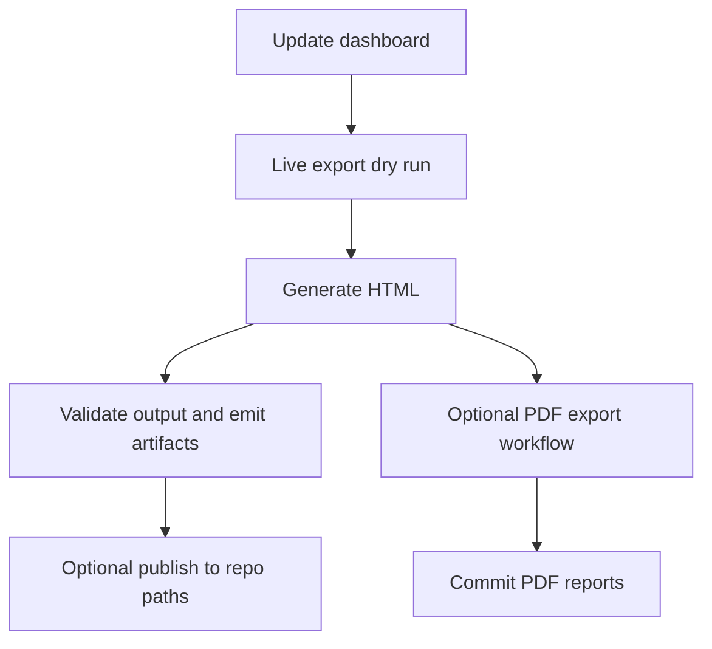

# Workflow Notes

This repo currently ships five GitHub Actions workflows.

## Workflow summary

| Workflow | File | Purpose |
|---|---|---|
| Update Vulnerability Dashboard | `.github/workflows/update-vulnerability-dashboard.yml` | Run the live export and dashboard validation path, upload artifacts, and optionally publish repo outputs |
| Validate Dashboard | `.github/workflows/validate-dashboard.yml` | Run the deterministic repo preflight used for local and PR validation |
| Sync Azure Runbook | `.github/workflows/sync-azure-runbook.yml` | Rebuild and commit `azure/Invoke-DashboardPipeline.ps1` when its build sources change |
| Build Azure Package | `.github/workflows/sync-azure-package.yml` | Build the latest Azure deployment zip and upload it as a downloadable workflow artifact |
| Export Dashboard PDFs | `.github/workflows/export-pdf-reports.yml` | Render PDF report variants from the latest committed dashboard |

## Flow

## Update Vulnerability Dashboard

Trigger sources:

- Daily schedule at `02:00 UTC`
- Manual run with optional `dry_run`

Key behavior:

- Uses repo-owned Azure OIDC logic through `build/Invoke-LiveDashboardDryRun.ps1`
- Runs the live export and dashboard validation path before any publish step
- Uploads `dashboard-audit.json`, `dashboard-live-run-manifest.json`, and the generated `VulnerabilityDashboard.html` as workflow artifacts
- Commits `exports/` and `VulnerabilityDashboard.html` only when the run is not a dry run

## Validate Dashboard

Trigger sources:

- Pull requests that touch scripts, templates, exports, or workflow files
- Pushes to `main` for the same paths
- Manual run

Key behavior:

- Installs `PSScriptAnalyzer` and `Az.Accounts`
- Calls the repo-owned `build/Invoke-RegressionValidation.ps1` entrypoint
- Validates generated deployment artifacts, source scripts, regression helpers, the build-layer template publish contract, and committed-export dashboard generation through one deterministic path
- Smoke-tests the Azure zip packaging path with `build/Build-AzureReleasePackage.ps1`

## Export Dashboard PDFs

Trigger sources:

- Manual run today
- Optional scheduled run if you uncomment the cron entry in the workflow

Key behavior:

- Checks whether committed PDF exports are older than `VulnerabilityDashboard.html`
- Uses Playwright and `.github/scripts/export-pdf-reports.js`
- Commits updated files under `reports/`
- Uploads generated PDFs as a workflow artifact

## Sync Azure Runbook

Trigger sources:

- Pushes that touch `build/azure/runbook-source.ps1`, `src/powershell/Shared/`, `build/manifests/`, or the runbook build scripts
- Manual run

Key behavior:

- Runs `./build/azure/Build-Runbook.ps1`
- Stages `azure/Invoke-DashboardPipeline.ps1`
- Commits and pushes the regenerated runbook only when the artifact changed

## Build Azure Package

Trigger sources:

- Pushes to `main` that change Azure package inputs
- Manual run

Key behavior:

- Installs `Az.Accounts`
- Runs `build/Build-AzureReleasePackage.ps1`
- Packages `Setup-AzureResources.ps1`, `templates/`, and `azure/` into `Azure-YYMMDD-<commit>.zip`
- Uploads that zip as a workflow artifact for download from the Actions run

## Suggested operating model

- Use the update workflow for the regular daily refresh
- Let the validation workflow protect changes to scripts and templates through the same deterministic preflight used locally
- Let the runbook sync workflow keep the committed Azure Automation artifact aligned with the build sources
- Use the Azure package workflow when you want a fresh downloadable deployment bundle without committing a binary into the repository
- Use `tests/Invoke-AzureRunbookValidation.ps1` for guarded, temporary candidate validation against a real Automation account; it requires an explicit subscription and restores the runbook and storage state after the run
- Run the PDF workflow only when the HTML dashboard changes enough to warrant fresh report exports
- Use `build/Invoke-LiveDashboardDryRun.ps1 -UseExistingAzContext` locally when you need exact-path validation for the live export flow before publishing

## Related docs

- [Azure setup](azure-setup.md)
- [GitHub Actions setup](github-actions-setup.md)
