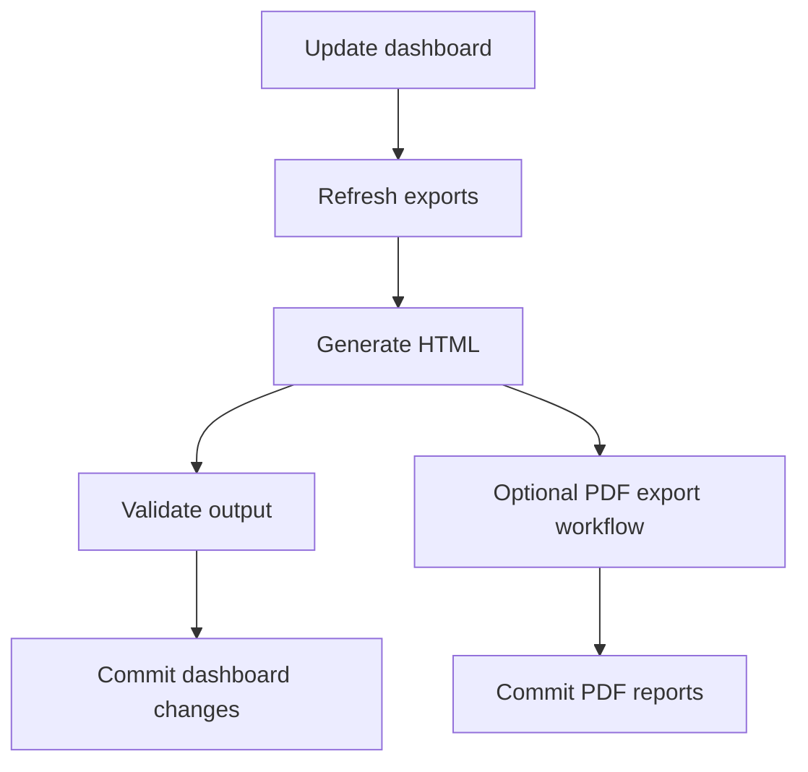

# Workflow Notes

This repo currently ships three GitHub Actions workflows.

## Workflow summary

| Workflow | File | Purpose |
|---|---|---|
| Update Vulnerability Dashboard | `.github/workflows/update-vulnerability-dashboard.yml` | Export data, rebuild the dashboard, validate it, and commit changes |
| Validate Dashboard | `.github/workflows/validate-dashboard.yml` | Lint PowerShell, rebuild the generated runbook, and regenerate the dashboard for verification |
| Export Dashboard PDFs | `.github/workflows/export-pdf-reports.yml` | Render PDF report variants from the latest committed dashboard |

## Flow

## Update Vulnerability Dashboard

Trigger sources:

- Daily schedule at `02:00 UTC`
- Manual run with optional `dry_run`
- Pushes to `test/**`

Key behavior:

- Uses Azure OIDC authentication
- Calls `Invoke-VulnerabilityExport.ps1` with `-IncludeAdvancedHunting`
- Calls `Generate-VulnerabilityDashboard.ps1` with `-Validate`
- Uploads `dashboard-audit.json` as an artifact
- Commits `exports/` and `VulnerabilityDashboard.html` unless the run is a dry run

## Validate Dashboard

Trigger sources:

- Pull requests that touch scripts, templates, exports, or workflow files
- Pushes to `main` and `test/**` for the same paths
- Manual run

Key behavior:

- Runs `PSScriptAnalyzer` across repo PowerShell scripts
- Rebuilds `azure/Invoke-DashboardPipeline.ps1` from source and fails if the generated file is stale
- Regenerates and validates the dashboard from committed exports

## Export Dashboard PDFs

Trigger sources:

- Manual run today
- Optional scheduled run if you uncomment the cron entry in the workflow

Key behavior:

- Checks whether committed PDF exports are older than `VulnerabilityDashboard.html`
- Uses Playwright and `.github/scripts/export-pdf-reports.js`
- Commits updated files under `reports/`
- Uploads generated PDFs as a workflow artifact

## Suggested operating model

- Use the update workflow for the regular daily refresh
- Let the validation workflow protect changes to scripts and templates
- Run the PDF workflow only when the HTML dashboard changes enough to warrant fresh report exports

## Related docs

- [Azure setup](azure-setup.md)
- [GitHub Actions setup](github-actions-setup.md)
