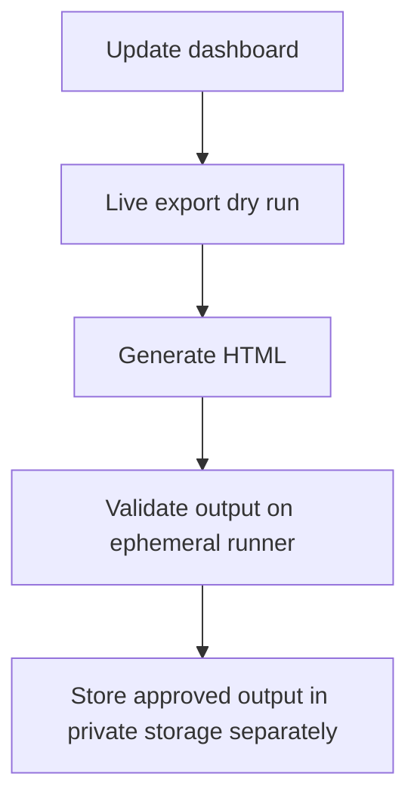

# Workflow Notes

This repo currently ships six GitHub Actions workflows.

## Workflow summary

| Workflow | File | Purpose |
|---|---|---|
| Update Vulnerability Dashboard | `.github/workflows/update-vulnerability-dashboard.yml` | Private repositories only: run live export and dashboard validation on an ephemeral runner without publishing live data |
| Validate Dashboard | `.github/workflows/validate-dashboard.yml` | Run the deterministic repo preflight used for local and PR validation |
| Sync Azure Runbook | `.github/workflows/sync-azure-runbook.yml` | Rebuild and commit `azure/Invoke-DashboardPipeline.ps1` when its build sources change |
| Build Azure Package | `.github/workflows/sync-azure-package.yml` | Build the latest Azure deployment zip and upload it as a downloadable workflow artifact |
| Release Azure Package | `.github/workflows/release-azure-package.yml` | Build `Azure-YYMMDD.zip` from the published release tag and attach it to the GitHub release |
| Export Dashboard PDFs | `.github/workflows/export-pdf-reports.yml` | Private repositories only: render PDFs without publishing live reports; remains disabled pending a private source |

Both live-data jobs require `${{ github.event.repository.private == true }}`. Keep these workflows disabled in public repositories; the job-level guards skip execution even if triggered. Exporter logs can expose RBAC group IDs and counts, so omitting commits and artifacts alone is not sufficient.

## Flow

```mermaid
flowchart TD
    A["Update dashboard"] --> B["Live export dry run"]
    B --> C["Generate HTML"]
    C --> D["Validate output on ephemeral runner"]
    D --> E["Store approved output in private storage separately"]
```

## Update Vulnerability Dashboard

Trigger sources:

- Daily schedule at `02:00 UTC`
- Manual run

Key behavior:

- Uses repo-owned Azure OIDC logic through `build/Invoke-LiveDashboardDryRun.ps1`
- Runs the live export and dashboard validation path under `.local/` on the ephemeral runner
- Does not upload artifacts or commit exports, dashboards, or audit data to this public repository
- Runs only in private repositories; remains disabled/skipped in public repositories

## Validate Dashboard

Trigger sources:

- Pull requests that touch scripts, templates, exports, or workflow files
- Pushes to `main` for the same paths
- Manual run

Key behavior:

- Installs `PSScriptAnalyzer` and `Az.Accounts`
- Calls the repo-owned `build/Invoke-RegressionValidation.ps1` entrypoint
- Validates generated deployment artifacts, source scripts, regression helpers, the build-layer template publish contract, and committed-export dashboard generation through one deterministic path
- Builds and extracts the Azure zip, asserts that it contains no `build/` dependency, and smoke-tests the packaged `azure/Upload-Templates.ps1` entrypoint

## Export Dashboard PDFs

Trigger sources:

- Manual run today
- Optional scheduled run in a private repository if you uncomment the cron entry in the workflow

Key behavior:

- Checks whether committed PDF exports are older than `VulnerabilityDashboard.html`
- Uses Playwright and `.github/scripts/export-pdf-reports.js`
- Does not commit or upload generated PDFs
- Runs only in private repositories; remains disabled/skipped in public repositories
- In private repositories, remains disabled until a private dashboard source replaces the committed HTML

## Sync Azure Runbook

Trigger sources:

- Pushes that touch `build/azure/runbook-source.ps1`, `src/powershell/Shared/`, `build/manifests/`, or the runbook build scripts
- Manual run

Key behavior:

- Runs `./build/azure/Build-Runbook.ps1`
- Stages `azure/Invoke-DashboardPipeline.ps1`
- Commits and pushes the regenerated runbook only when the artifact changed

## Build Azure Package

Trigger sources:

- Pushes to `main` that change Azure package inputs
- Manual run

Key behavior:

- Installs `Az.Accounts`
- Runs `build/Build-AzureReleasePackage.ps1`
- Packages `Setup-AzureResources.ps1`, `templates/`, and `azure/` into `Azure-YYMMDD-<commit>.zip`
- Uploads that zip as a workflow artifact for download from the Actions run

## Release Azure Package

Trigger sources:

- Published GitHub releases

Key behavior:

- Checks out the published release tag so the package matches the release contents
- Installs `Az.Accounts`
- Runs `build/Build-AzureReleasePackage.ps1`
- Packages `Setup-AzureResources.ps1`, `templates/`, and `azure/` into `Azure-YYMMDD.zip`
- Uploads the zip as a release asset, replacing any existing asset with the same name

## Suggested operating model

- Use the update workflow for the regular daily refresh only in a private repository
- Let the validation workflow protect changes to scripts and templates through the same deterministic preflight used locally
- Let the runbook sync workflow keep the committed Azure Automation artifact aligned with the build sources
- Use the Azure package workflow when you want a fresh downloadable deployment bundle without committing a binary into the repository
- Publish a GitHub release when you want the release-specific `Azure-YYMMDD.zip` asset attached automatically
- Use `tests/Invoke-AzureRunbookValidation.ps1` for guarded, temporary candidate validation against a real Automation account; it requires an explicit subscription and restores the runbook and storage state after the run
- Run the PDF workflow only in a private repository with a private dashboard source, when the HTML dashboard changes enough to warrant fresh report exports
- Use `build/Invoke-LiveDashboardDryRun.ps1 -UseExistingAzContext` locally when you need exact-path validation for the live export flow before deploying to access-controlled storage

## Related docs

- [Azure setup](azure-setup.md)
- [GitHub Actions setup](github-actions-setup.md)
